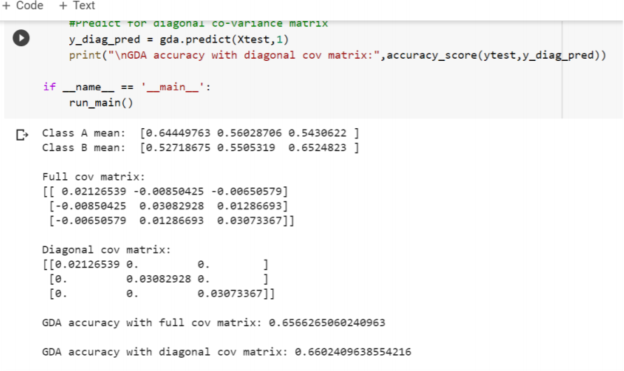
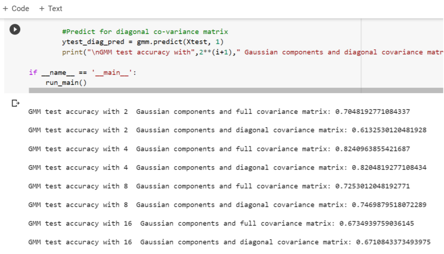

# Gaussian-models-from-scratch

In this project, we create and compare two Gaussian based models, namely Multivariate Gaussian models and Gaussian Mixture Models.

## Multivariate Gaussian models

Description:
Implemented a simple classifier using multivariate Gaussian models. Each class in the data is modeled by a single 3D Gaussian distribution.

Two different structures for the covariance matrices are considered for the model, which are:

- Each Gaussian uses a diagonal covariance matrix.
- Each Gaussian uses a full covariance matrix

Model Explanation:

We first start by loading and preprocessing the data. The data is loaded via the read csv method which render the data in a dataframe. Next, we convert the dataframe into numpy arrays and separate the labels from the input data. The input data is further normalized for faster processing and the binary labels are converted to 0, 1 labels for easier processing.

Now, to build a binary classifier using multivariate Gaussian models, we build a class called GDA that consists of all model functions and parameters. We initialize the model with the training data and separate the two classes to model their individual Gaussian distributions.

Next, for each class we compute the mean and covariance matrix for the Gaussian distribution and the diagonal elements of the full covariance matrix are taken to build the diagonal covariance matrix for each class. We thus complete the training part of the model and print the mean vectors, covariance vectors, and diagonal vectors for both classes. Next, we evaluate the model on the test data. The predict function takes in the test data and the co var mat parameter which takes the full covariance matrix for prediction if set to 0, else takes the diagonal covariance matrix. Thus, for every point in the test data, its probability is computed for both the classes, and the point is assigned to the class with a higher probability. This probability is computed using the MAP decision rule. We call the predict function for both the full covariance matrix and the diagonal covariance matrix, and compare the accuracy between the two. We thus obtain the following results for the experiment: 

From the results, we observe that the multivariate Gaussian model does not fit the training data very well due to its high dimension and thus requires a more complex model. This can be verified with the accuracies obtained on the test data where the model performs slightly better with the diagonal covariance matrix.

## Gaussian Mixture Models

Description:
To improve the Gaussian classifier from the multivariate Gaussian model by using a Gaussian Mixture Model to model each class.

Investigate the Gaussian Mixture Models that have 2, 4, 8, or 16 Gaussian components and determine the best model configuration in terms of the number of Gaussian components and the covariance matrix structure (diagonal vs. full) for the given data set.

Model Explanation:
Here, we implement Gaussian Mixture Models (GMMs) for the two classes in the dataset. We build a separate GMM for each class, and cluster each GMM into a given number of clusters. Next, we predict the class of each data in a given GMM using the MAP rule and evaluate the predictions against their true labels

We initialize the model using the number of clusters and the number of training epochs. For faster training, the number of epochs is 1 here for which the model gives sufficiently good results. Next, we separate the training data according to their classes and initiate the model training for each class. The training process for each class includes initializing the mean vector, the covariance vector, and the weights vector using k-means clustering which will be used as starting points for the GMM. Next, the ’E’ and the ’M’ steps are performed for each class which update the phi and the weights variables in the ’E’ step, and the mean and the covariance variables in the ’M’ step. This process continues for a given number of epochs and return the mean vector, covariance matrix, and the diagonal covariance matrix upon completion. Thus, we obtain all three variables (mean, covariance, diagonal covariance) for each cluster in a given class.

Now, to predict the class of each data point in the test data, we first predict the cluster that each data point belongs to. Once the class labels for each data point are obtained, we predict the probability of both classes on the given data point using the mean and variance of the given cluster. This mean and variance for a given cluster is more accurate since it contains more data points concentrated in a given region and hence the values are more likely to be closer to the true value. We thus predict the class label for each data point in the test set and evaluate against the true labels. We obtain the following results when we compare with various combinations of the model including 2, 4, 8, 16 Gaussian components, both with the full covariance matrix and the diagonal covariance matrix. A best of 5 runs was taken as the result for the experiment.

As we see in the results, the GMM model performed much better than the multivariate Gaussian models since they were able to model the data in higher dimensions and thus compute accurate classifications. The model was also trained for only one epoch for this experiment for which the GMMs are able to provide sufficiently good results. We also notice that among all the different number of clusters and thus their Gaussian components, we find that GMMs performed best with 4 Gaussian components followed by 8, 2, and 16 for this dataset. Thus, we can conclude that the mixture models are better able to capture the features of the training data as compared to multivariate Gaussian models and thus give a better accuracy/ result on the data.
